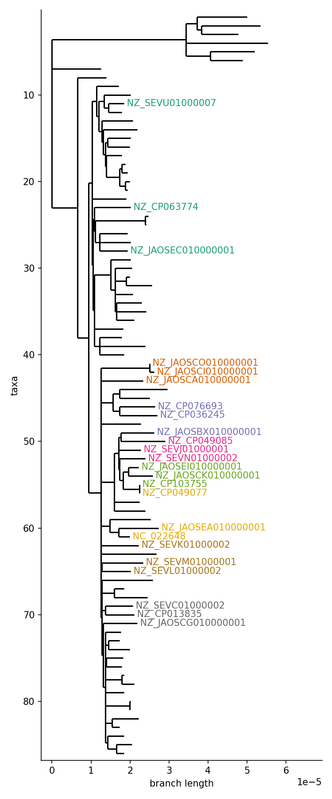

# part 1: structural diversity around bla gene

The aim of this part of the analysis is using pangraph to compare the structural diversity of the region surrounding the beta lactamase gene in these chromosomes.

The file `data/bla15.fa` contains the nucleotide sequence of a beta-lactamase CTX-M-15 gene ([UniProt](https://www.uniprot.org/uniprotkb/G8FPM5) | [GenBank](https://www.ncbi.nlm.nih.gov/nuccore/JN019833)).

## step 1: extracting the regions surrounding bla gene

We use minimap2 to find matches for the bla gene on the chromosomes (rule `map_bla` in the workflow):
```bash
minimap2 -x asm5 data/bla15.fa data/ST131_fa/* > results/bla15/map.paf
```

This finds 29 matches on 24 different isolates, with 4 isolates having multiple matches:
```
isolate               count
NZ_CP013835           3
NZ_SEVM01000001       2
NZ_JAOSEC010000001    2
NZ_JAOSCG010000001    2
```

## step 2: core-genome distance between isolates

As a preliminary step we evaluate the core-genome distance 

To

```bash
python3 scripts/assign_leaves_color.py \
    --paf {input.paf} \
    --tree {input.tree} \
    --fig {output.fig} \
    --color_csv {output.color}
```
{: style="width=100px;"}


## step 3: simple gene alignment

As a first preliminary step in the analysis we can generate an alignment from the mapping to check the quality of the detected matches, and see if we can extract phylogenetic information from the alignment.

We use the same script to extract a part of the sequence from the match, but this time we select a window of size 0, so that only the matching sequence is extracted (rule `extract_window` with `w=0`):
```bash
python3 scripts/extract_matches.py \
    --in_fa data/ST131_fa/* \
    --paf results/bla15/map.paf \
    --window 0 \
    --length 400 \
    --out results/bla15/extracted_window_0.fa
```

We then use `mafft` to align the extracted sequences (rule `extract_alignment`):
```bash
mafft --auto --adjustdirection \
    results/bla15/extracted_window_0.fa > results/bla15/bla_alignment.fa
```

Inspection of this alignment reveals that these matches are all identical and no phylogenetic information can be extracted.


## step 4: building a pangenome graph of the surrounding region


We then use the script `script/extract_matches.py` to extract a ~10 kbp window (5kbp upstream and 5kbp downstream) around the match (rule `extract_window` with `w=5000`).
```bash
python3 scripts/extract_matches.py \
    --in_fa data/ST131_fa/* \
    --paf results/bla15/map.paf \
    --window 5000 \
    --length 400 \
    --out results/bla15/extracted_window_5000.fa
```


We then build a pangraph using the sequences of the regions surrounding the bla gene (rule `build_window_pangraph`):
```bash
pangraph build \
    -l 50 -a 10 -b 10 -s 5 \
    results/bla15/extracted_window_5000.fa \
    > results/bla15/pangraph_window.json 
```

The aim is to use the structural diversity around this region to visualize relatedness between different genes.

