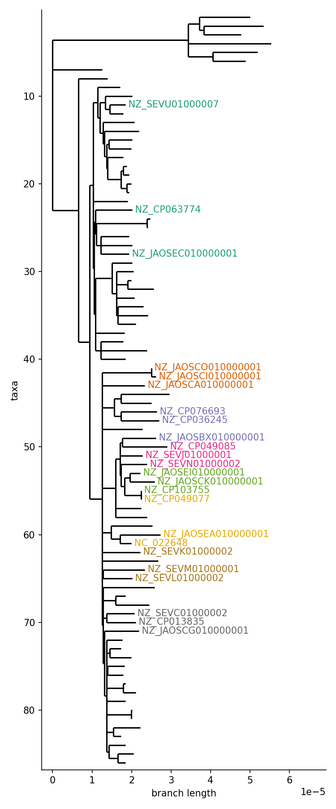
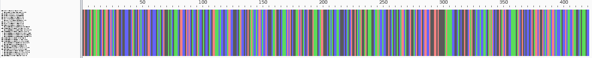
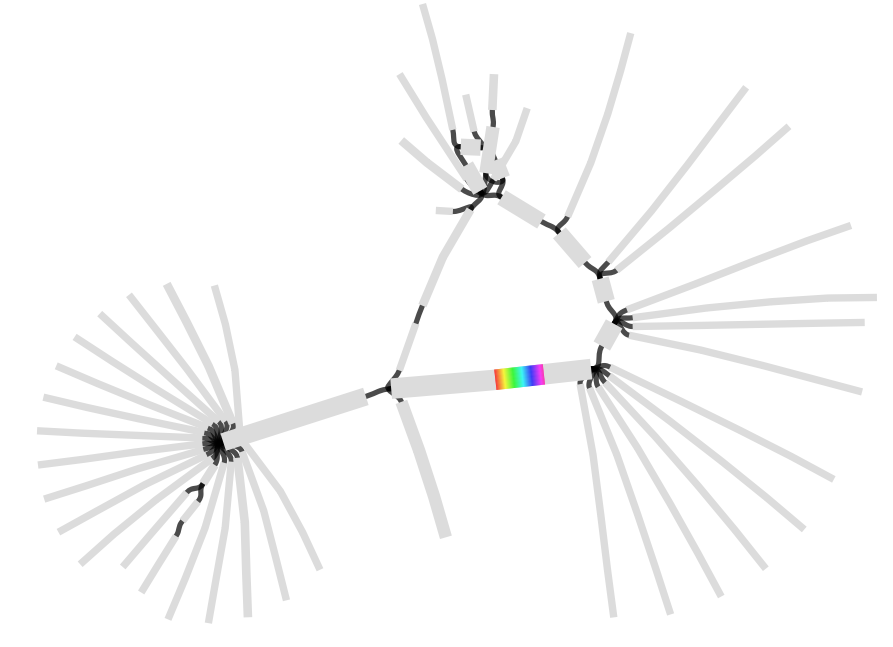
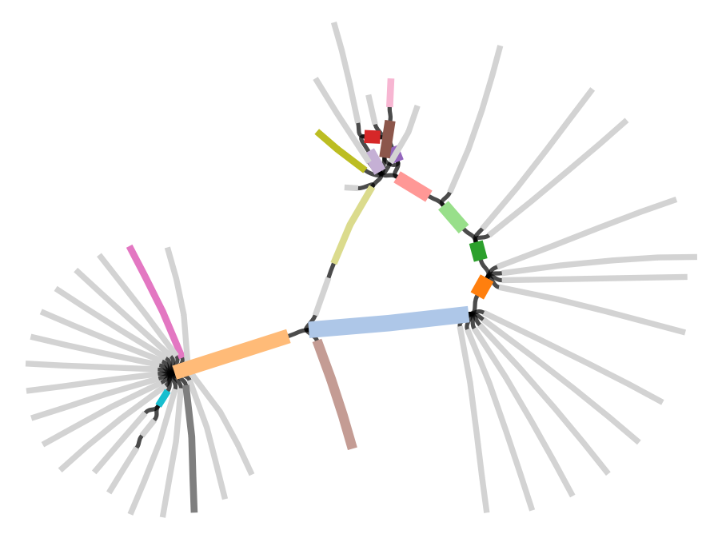
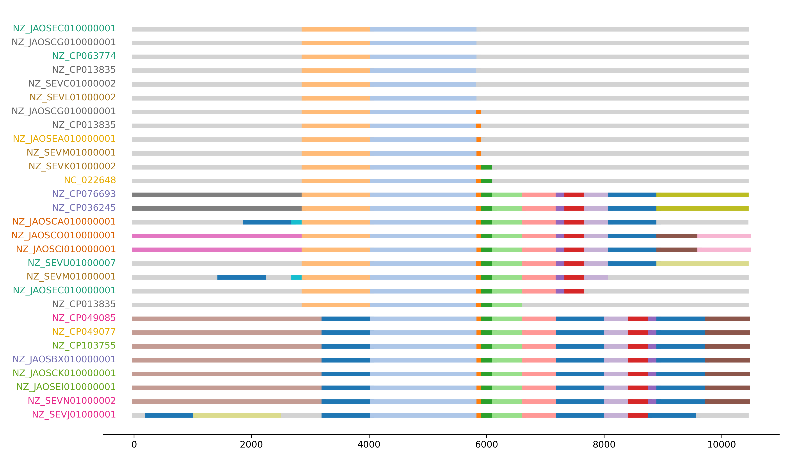
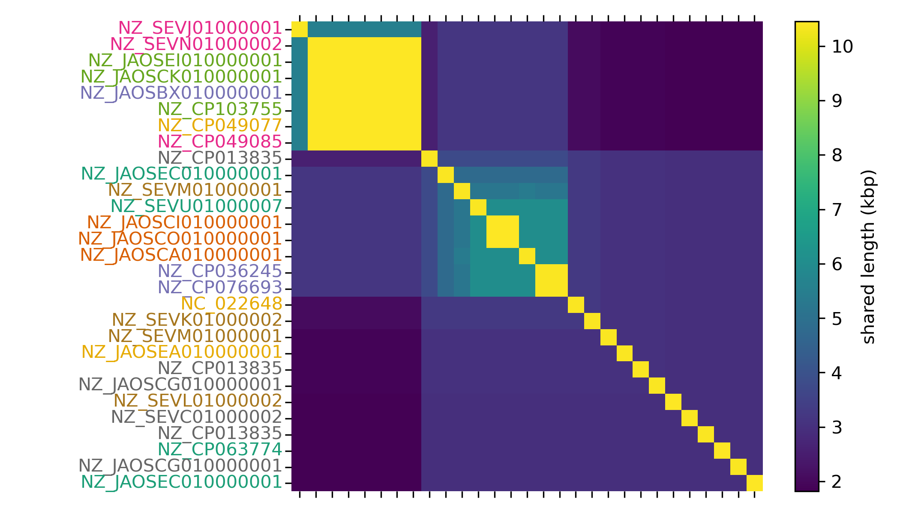
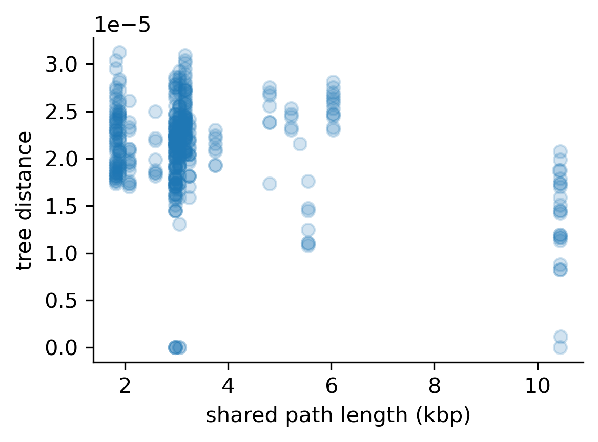
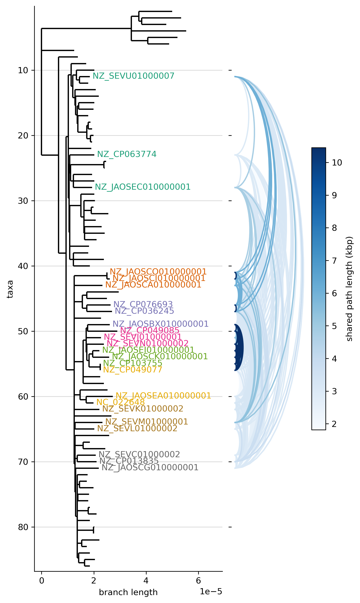

# part 1: structural diversity around bla gene

The aim of this part of the analysis is using pangraph to compare the structural diversity of the region surrounding the beta lactamase gene in these chromosomes, and check how this compares to the core-genome tree.

The file `data/bla15.fa` contains the nucleotide sequence of a beta-lactamase CTX-M-15 gene ([UniProt](https://www.uniprot.org/uniprotkb/G8FPM5) | [GenBank](https://www.ncbi.nlm.nih.gov/nuccore/JN019833)).

## step 1: finding occurrences of the _bla_ gene

We use minimap2 to find matches for the bla gene on the chromosomes (rule `map_bla` in the workflow):
```bash
minimap2 -x asm5 data/bla15.fa data/ST131_fa/* > results/bla15/map.paf
```

This finds 29 matches on 24 different isolates, with 4 isolates having multiple matches:
```
isolate               count
NZ_CP013835           3
NZ_SEVM01000001       2
NZ_JAOSEC010000001    2
NZ_JAOSCG010000001    2
```

## step 2: core-genome distance between isolates

In the `data/coretree.nwk` we provide a core-genome tree for the isolates. This was build using PanGraph, by constructing a graph from all of the isolates and extracting the alignments for all of the core block, taking care of filtering out highly-recombined regions.

We visualize which of the isolates on the tree contains the _bla_ gene on the chromosome with the following script (rule `bla_assign_color_to_isolate`):
```bash
python3 scripts/assign_leaves_color.py \
    --paf results/bla15/map.paf \
    --tree data/coretree.nwk \
    --fig figs/bla_coretree.png \
    --color_csv results/bla15/isolate_color.csv
```
<p align="center">
    
</p>

The script also assigns a color to each of these isolates, according to the order on which they appear on the tree. This is saved in `results/bla15/isolate_color.csv`.

## step 3: simple gene alignment

As a first preliminary step in the analysis we can generate an alignment from the mapping to check the quality of the detected matches, and see if we can extract phylogenetic information from the alignment.

We use the same script to extract a part of the sequence from the match, but this time we select a window of size 0, so that only the matching sequence is extracted (rule `extract_window` with `w=0`):
```bash
python3 scripts/extract_matches.py \
    --in_fa data/ST131_fa/* \
    --paf results/bla15/map.paf \
    --window 0 \
    --length 400 \
    --out results/bla15/extracted_window_0.fa
```

We then use `mafft` to align the extracted sequences (rule `extract_alignment`):
```bash
mafft --auto --adjustdirection \
    results/bla15/extracted_window_0.fa > results/bla15/bla_alignment.fa
```

Inspection of this alignment reveals that these matches are all identical and no phylogenetic information can be extracted.


We will therefore resort to looking at the genome organization around the resistance gene, using PanGraph.

## step 4: building a pangenome graph of the region surrounding _bla_

We use the script `script/extract_matches.py` to extract a ~10 kbp window (5kbp upstream and 5kbp downstream) around the match (rule `extract_window` with `w=5000`).
```bash
python3 scripts/extract_matches.py \
    --in_fa data/ST131_fa/* \
    --paf results/bla15/map.paf \
    --window 5000 \
    --length 400 \
    --out results/bla15/extracted_window_5000.fa
```

We then build a pangraph using the sequences of the regions surrounding the bla gene (rule `build_window_pangraph`):
```bash
pangraph build \
    -l 50 -a 10 -b 10 -s 5 \
    results/bla15/extracted_window_5000.fa \
    > results/bla15/pangraph_window.json 
```

This graph can be exported using the `export` command of pangraph (rule `export_window_pangraph`):
```bash
pangraph export \
    -nd \
    --edge-minimum-length 0 \
    -o results/bla15/export \
    results/bla15/pangraph_window.json 
```

We use the `-nd` flag to avoid exporting duplicates, to limit the complexity of the graph visualization.
This generates two files in the `export` folder: `pangraph.gfa` and `pangraph.fa`.
The former can be visualized with software such as [Bandage](https://rrwick.github.io/Bandage/). Here is a visualization in which we used the `blast` option to highligh the region containing the _bla_ gene.

<p align="center">
    
</p>

The `pangraph.fa` file contains instead the consensus sequence of each block in the graph. We can use it to find the name of the block containing the _bla_ gene (rule `find_bla_block`):
```bash
minimap2 data/bla15.fa results/bla15/export/pangraph.fa \
    | awk '{print $1}' \
    > results/bla15/bla_block.txt
```

## step 5: structural diversity of _bla_ gene neighbourhood

We can assign colors to every block that occurr more than once:

<p align="center">
    
</p>

And then we can produce a linear representation of the paths. Duplicated blocks were not present in the exported graphs but are present in the paths.


We evaluate structural diversity in the following way:
- we define the _anchor block_ as the block containing the _bla_ gene, which is present in every path.
- for every pair of paths we start from the anchor block, and following the strandedness of the paths we try to extend the match upstream and downstream of this block, until we get a point with structural diversity.
- the _shared path length_ is the length of this maximum matching.

Here is a matrix representation of the pariwise shared length:
<p align="center">
    
</p>

All of these representations are produced by the `bla_structural_diversity.py` script. This script:
- loads the pangenome graph using [pypangraph](https://github.com/mmolari/pypangraph), a python package used to inspect and manipulate the pangenome graphs produced by PanGraph.
- evaluates the pairwise shared length starting from the anchor blocks for all pairs of paths.
- perform hierarchical clustering on the resulting similarity matrix. This is done to obtain an order for the paths that groups similar pahts together.
- produces the linear visualization of the paths. Colors assigned to each block are saved in the `results/bla15/block_colors.csv` file. This file can be loaded in bandage to obtain the visualization displayed above.
- plots the similarity matrix.

Usage is as follows (rule `bla_structural_diversity`):
```bash
python3 scripts/bla_structural_diversity.py \
    --pangraph results/bla15/pangraph_window.json  \
    --anchor_block $(cat results/bla15/bla_block.txt) \
    --leaves_colors results/bla15/isolate_color.csv \
    --fig_paths figs/bla_paths_drawing.png \
    --fig_matrix figs/bla_paths_shared_len.png \
    --block_colors results/bla15/block_colors.csv \
    --shared_len_df results/bla15/shared_bla_length.csv
```

## step 6: comparison with the core genome tree

As a final step for this part of the tutorial we use the results we obtained to compare similarity between paths to the distance in core genome.

If we scatter-plot the core-genome tree distance against the length of shared paths for each isolate we obtain a weak negative correlation:

<p align="center">
    
</p>

Given that these isolates only have few SNPs on their core genome (50-100 SNPs on a core genome of several Mbps) the core genome tree distance is noisy. Given the fast dynamics with which resistance genes are gained and lost, looking at the structural similarity of the context in which these genes are integrated might provide a much better measure of relatedness.

A more clear visualization can be obtained by drawing links between isolates that share the _bla_ gene, with the color of the link representing the length of the shared path.

<p align="center">
    
</p>

These visualizations are produced by the follwing script (rule `bla_structure_vs_coretree`):
```bash
python3 scripts/shared_paths_vs_coretree.py \
    --shared_len_df results/bla15/shared_bla_length.csv \
    --tree data/coretree.nwk \
    --leaves_colors results/bla15/isolate_color.csv \
    --fig_scatter figs/bla_shared_len_vs_coretree_scatter.png \
    --fig_tree figs/bla_shared_len_vs_coretree.png
```

## summary

We used _PanGraph_ to build a graph of a ~10 kbp region surrounding the beta-lactamase gene. The sequence of these genes is highly conserved and no phylogenetic information can be extracted from the gene alignment. However we can use the pangenome graph to define a similarity measure for the context surrounding the resistance gene. 

Clades closer on the core genome tree tend to have more similar contexts. Very similar contexts are likely to indicate closely related strains or recent transfer events.