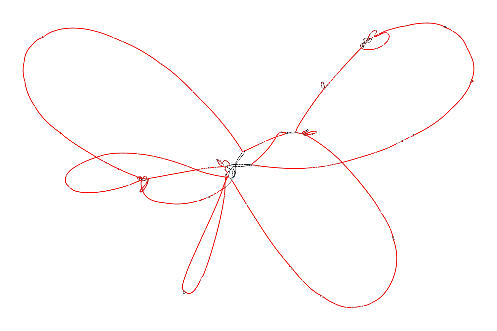
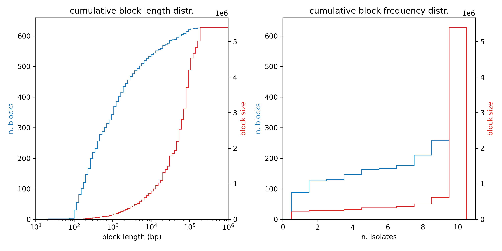
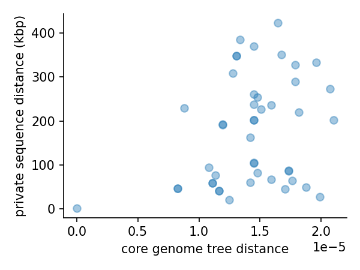
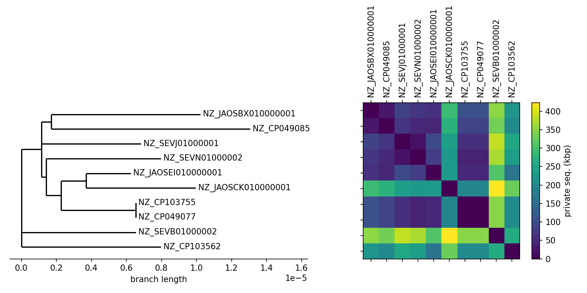

# using pangraph to estimate private sequence

In the previous tutorial we identified a clade with high structural similarity in the region surrounding the beta-lactamase gene.

In this second part of the tutorial we build a pangenome graph containing 10 whole chromosomes of isolates from a part of the tree that includes this clade. We then use this graph to measure how much of accessory genome is not shared for any given pair of isolates.

## step 1: building the pangenome graph

We start by building a pangenome graph for the selected isolates. These are encoded in the `config/config.yaml` (`strains-subset` entry).

The graph can be constructed with the command (rule `build_subset_pangraph`):
```bash
JULIA_NUM_THREADS=3
pangraph build --circular -a 20 -b 5 -s 20 \
    data/ST131_fa/NZ_CP049077.fa \
    data/ST131_fa/NZ_CP049085.fa \
    data/ST131_fa/NZ_CP103562.fa \
    data/ST131_fa/NZ_CP103755.fa \
    data/ST131_fa/NZ_JAOSBX010000001.fa \
    data/ST131_fa/NZ_JAOSCK010000001.fa \
    data/ST131_fa/NZ_JAOSEI010000001.fa \
    data/ST131_fa/NZ_SEVB01000002.fa \
    data/ST131_fa/NZ_SEVJ01000001.fa \
    data/ST131_fa/NZ_SEVN01000002.fa \
    > results/pangraph/subset.json
```

With 3 threads running in parallel this operation should take around 3 minutes on a laptop.

Similarly to what done in part 1, we can export the pangenome graph in `gfa` format for visual inspection with [Bandage](https://rrwick.github.io/Bandage/)

```bash
pangraph export -nd \
    -o results/pangraph/export/subset \
    results/pangraph/subset.json
```

The resulting graph should be similar to this:


This graph looks more disordered than the one in the previous part of the tutorial, but the amount of synteny is extremely high considering that the amount of sequence is 2-3 orders of magnitude higher.

Color represents the depth of each block, with core blocks appearing red and singleton blocks appearing black. Disorder is mosty restricted to some variable regions. Tangled regions correspond to blocks that appear in different contexts on different genomes.

To have a more precise view of block length and depth distribution, we use the following simple script (rule `plot_block_distr`):
```bash
python3 scripts/plot_block_distr.py \
    --pangraph results/pangraph/subset.json \ 
    --fig figs/block_distr.png
```


As expected, most of the sequence of the pangenome graph is contained in blocks of length > 50 kbp, indicating a high level of synteny. The vast majority of the sequence is contained in core blocks (n. strains = 10), and the cumulative size of the sequence present in the graph (containing 10 isolates) is only slightly greater than the size of a single chromosome (~ 5 Mbp).


## step 2: evaluate pairwise non-shared sequence

We want to use the graph to quickly calculate for each pair of paths the amount of non-shared sequence. This is done with the following script:
```bash
python3 scripts/pairwise_private_seq.py \
    --pangraph results/pangraph/subset.json \
    --dist_df results/pangraph/private_seq_distance.csv
```

As in the previous part of the tutorial, this script makes use of [pypangraph](https://github.com/mmolari/pypangraph) to load and manipulate the graph. It saves all of the pairwise distances in the `results/pangraph/private_seq_distance.csv` file.

We use the following script to visualize these results:
```bash
python3 scripts/plot_private_seq.py
    --dist_df results/pangraph/private_seq_distance.csv
    --tree data/coretree.nwk
    --fig_scatter figs/private_seq_scatter.png
    --fig_matrix figs/private_seq_matrix.png
```



The amount of private sequence shows weak negative correlation with the core genome distance. Isolates with a very low density of SNPs on their core genome can have a very high amount of private sequence, up to several hundreds of genes. This can be even better visualized by comparing the core-genome tree with the private sequence distance matrix.



In the next part of the tutorial we will give a closer look at the following pair of isolates: `NZ_JAOSEI010000001` and `NZ_JAOSCK010000001`. In spite of being very close on the core genome tree, their genome differ by ~ 200kbp.

