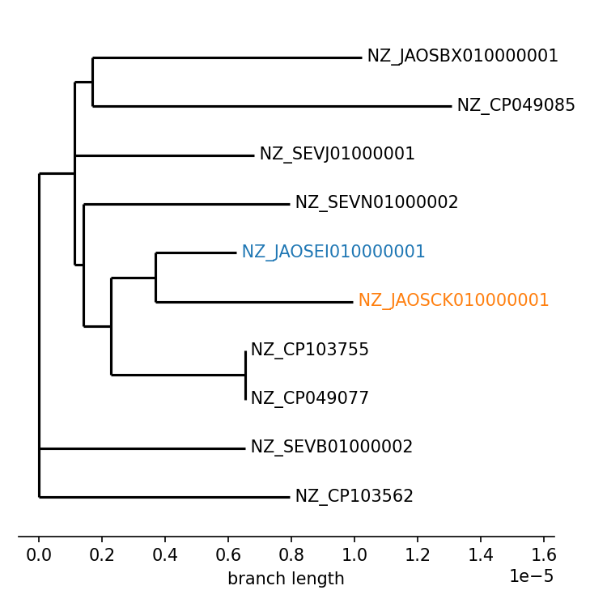

# accessory gene difference in a pair of isolates

In this last part of the tutorial we are interested in marginalizing the graph on a pair of isolates: `NZ_JAOSEI010000001` and `NZ_JAOSCK010000001`. These are part of the clade analyzed in the previous part of the tutorial. There we observed that in spite of being very close on the core-genome tree, these isolates have a large difference in accessory sequence (~200 kbps).

<p align="center">
    
</p>

In this part of the tutorial we want to investigate this sequence difference, to see whether this is due many isolated gene gain/loss events or a few large events.

## marginalizing the graph

We can use the `marginalize` command of `pangraph` to marginalize the graph we created in the previous part of the tutorial on a subset of strains. This will remove all nodes and edges that are not present in this subset, and will merge all resulting transitive edges. This operation is much faster than re-creating the graph from scratch, and is useful when many marginalizations are needed.

To marginalize the graph on the two isolates of interest, we can run (rule `marginalize`):
```bash
pangraph marginalize \
    --strains NZ_JAOSEI010000001,NZ_JAOSCK010000001 \
    results/pangraph/subset.json \
    > results/pangraph/marginalized.json
```

We can export the graph to `gfa` and visualize it with [Bandage](https://rrwick.github.io/Bandage/):
```bash
```bash
pangraph export -nd -ell 0 \
    -o results/pangraph/export_marginalized \
    results/pangraph/marginalized.json
```

<p align="center">
    
</p>

From the visualization we can see that the core genome of the two isolates is perfectly syntenic, and the graph can be plotted as a single loop. The main differences seem to be located in few large side-loops, containing sequence that is present in only one isolate and not the other.

This visualization seems to indicate that most of the difference in sequence is due to few large events.

## visualizing the pairwise projection

For a deeper look at these structural difference we can use [pypangraph](https://github.com/mmolari/pypangraph) to visualize the pairwise projection between the two strains.

We use the following script (`plot_graph_projection` rule) to generate a visualization in which one genome is used as a reference and the other is projected onto it:
```bash
python3 scripts/plot_graph_projection.py \
    --pangraph results/pangraph/marginalized.json \
    --fig figs/graph_projection.png
```

<p align="center">
    
</p>

Parts that have an exact correspondence are displayed in the circular backbone. Parts that are presents in only one isolate or the other are visualized as deviations from this backbone (outer blue layer for `NZ_JAOSEI010000001` and inner orange layer for `NZ_JAOSCK010000001`).

This shows that isolate `NZ_JAOSCK010000001` has two large deletions when compared to `NZ_JAOSEI010000001`, each having a size of ~ 70-80 kbp. These, together with an insertion of ~40 kbp present in `NZ_JAOSEI010000001` (upper right corner) explain most of the accessory sequence difference.

<p align="center">
    
</p>

Another advantage of this visualization is that it includes duplicated blocks. We did not export these blocks for the bandage visualization (`-nd` flag) because they tend to tangle up the graph and limit interpretability. However in this projection _pypangraph_ attempts a paralog-split operation. Duplicated blocks are assigned each a unique random color, and they are added to the common backbone if they appear on the same context in the two genomes.

In the visualization we notice that most of the accessory genome difference can be explained by few large events, but there is also a lot of fine-grained structural differences. These deviations from the common backbone are mostly in the proximity of duplicated blocks. This can be expected since these blocks often contain mobile genetic elements and insertion sequences, that are often mobilized and tend to generate structural diverstity.